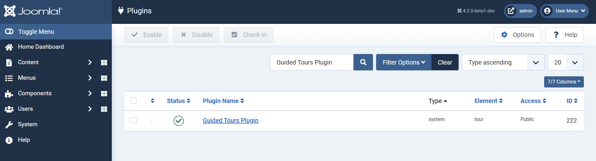
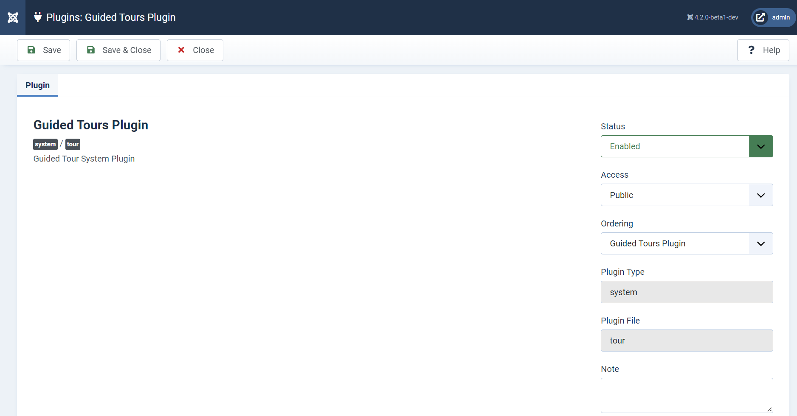
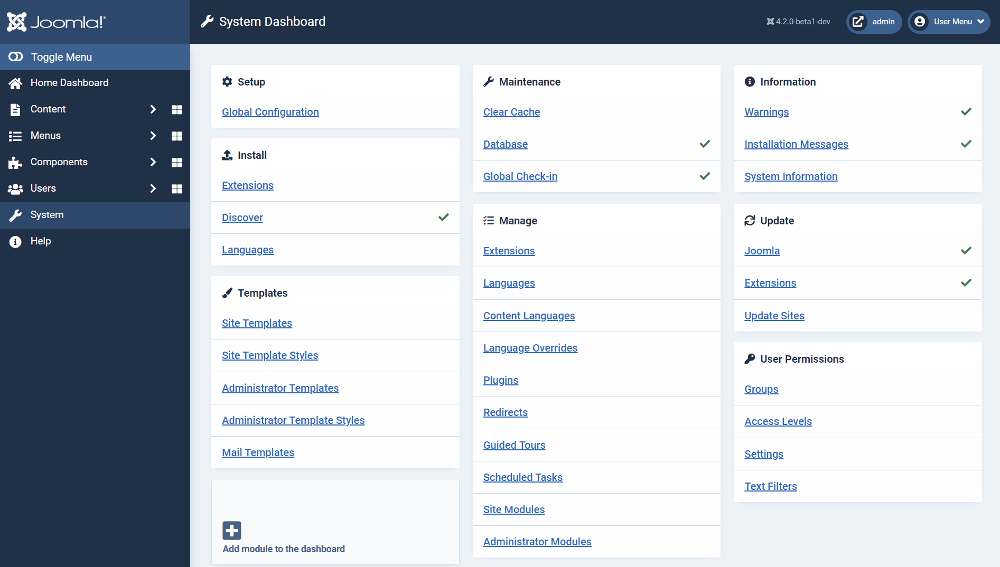
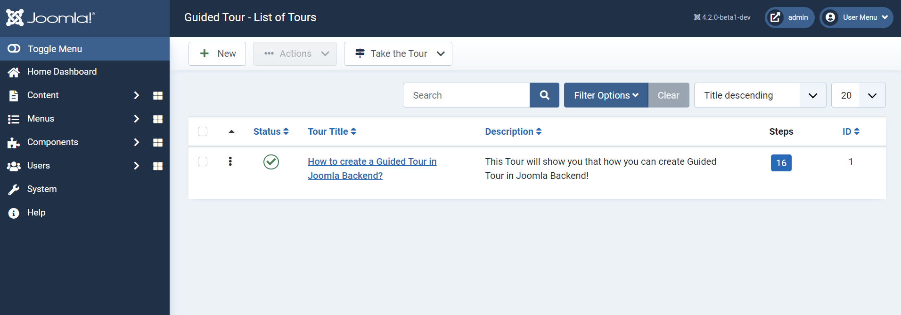

  

## Google SoC 2022 Overview
This repository contains details about my work in Google Summer of Code 2022. I have participated with Joomla! organization and worked on Guided Tour project.

**Project Overview :** [Guided Tour](https://summerofcode.withgoogle.com/programs/2022/projects/XJwp022t)

**Project Repository :** [Guided Tour Repository](https://github.com/joomla-projects/gsoc22_guided-tour)

### Overview
This feature is a click-through path which the user can follow to fulfill certain tasks and it will increase the convenience for the users. With this feature users don't need to read the bulky documentation.  

### Guided Tour Plugin
Go to System Dashboard > Manage module > Plugins > Guided Tours Plugin

  

### Guided Tour Plugin Overview

  

### Guided Tour Overview
Go to System Dashboard > Manage module > Guided Tours

  
  

  

## Working Guided Tour
https://user-images.githubusercontent.com/60094678/178741146-70bc7681-554e-4d53-b0d3-b3629b828f83.mp4
